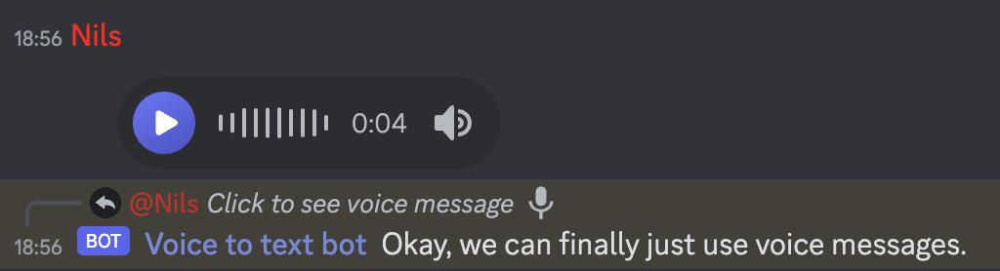
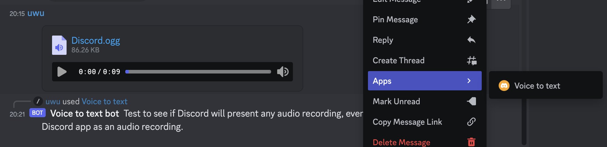

# Voice to text bot for discord

Discord introduced voice messages recently (first noticed it April 16 2023).

Voice messages are great when you have a lot to say but can't be bothered to
type it out. Unfortunately, they can be annoying to listen to. This bot
prints out the voice message as text.

The bot will also do speech-to-text on messages with audio attachments you DM
to it and messages with audio attachments you select in the Apps menu.

You can invite the bot using [this link][0].

## Screenshots

## License and Copyright

Voice to text bot for discord is licensed under the GNU AFFERO GENERAL PUBLIC
LICENSE Version 3.

Copyright © 2023 Nils André

[0]: https://discord.com/api/oauth2/authorize?client_id=1097877850289356870&permissions=3072&scope=bot
